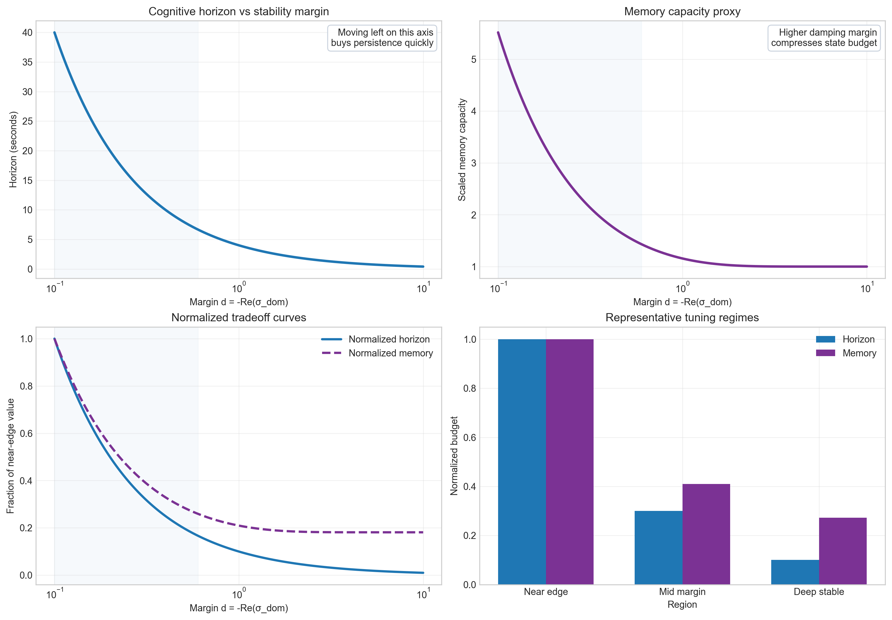
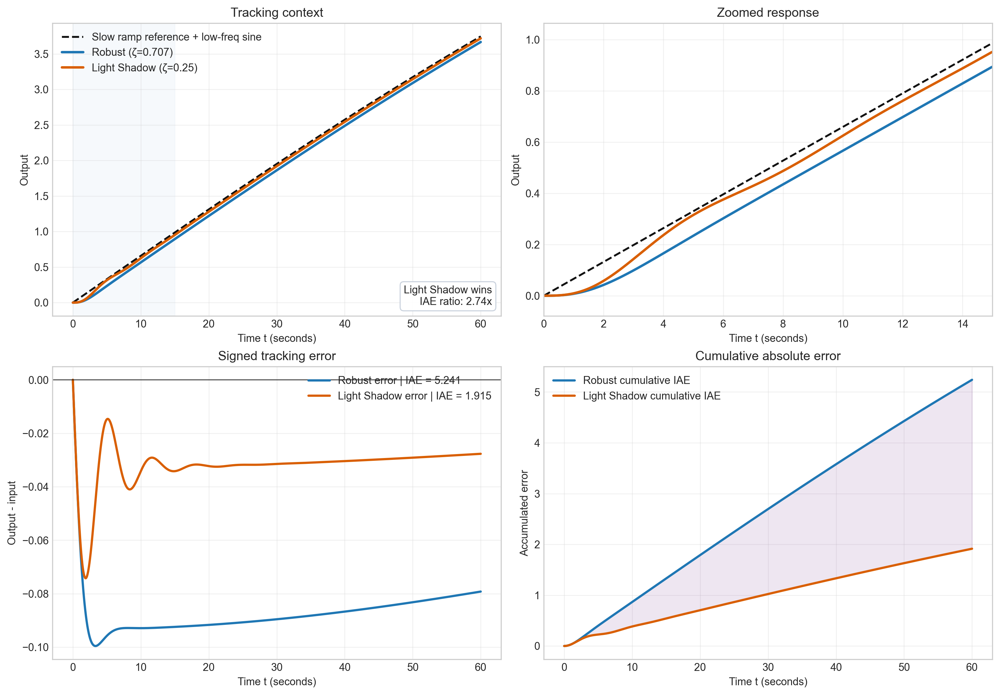
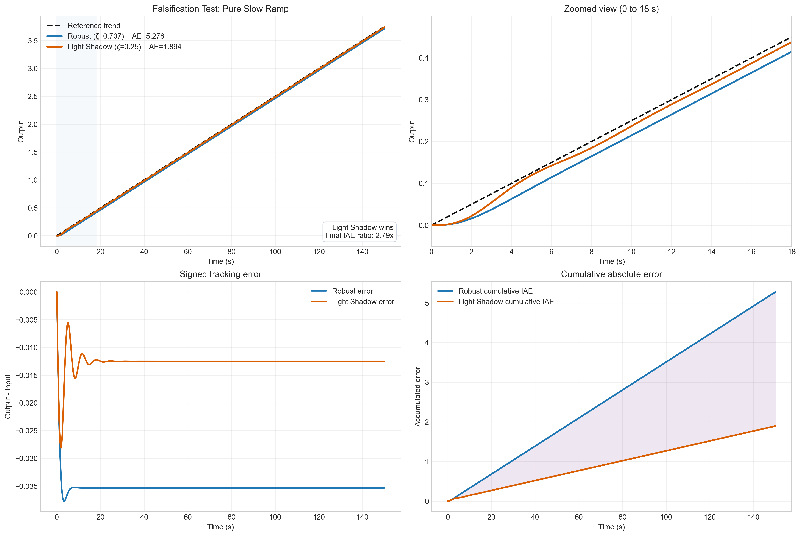
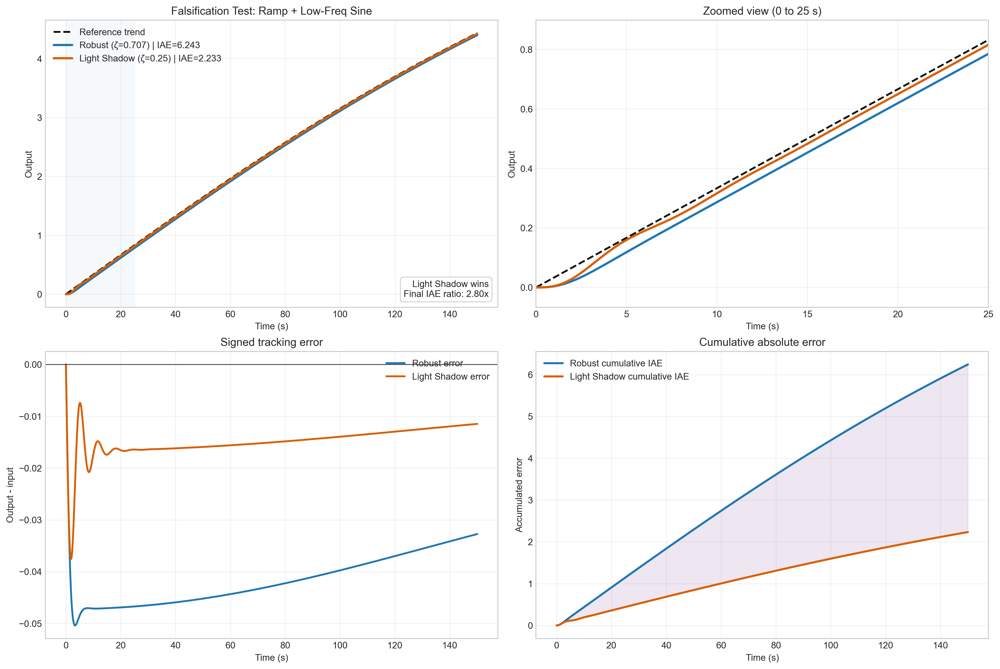
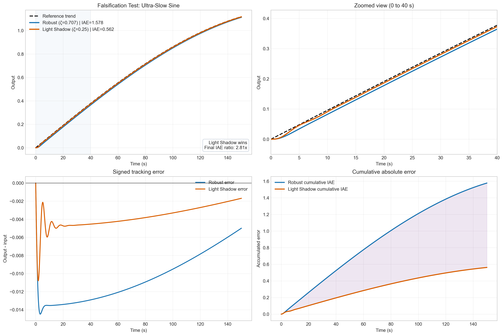
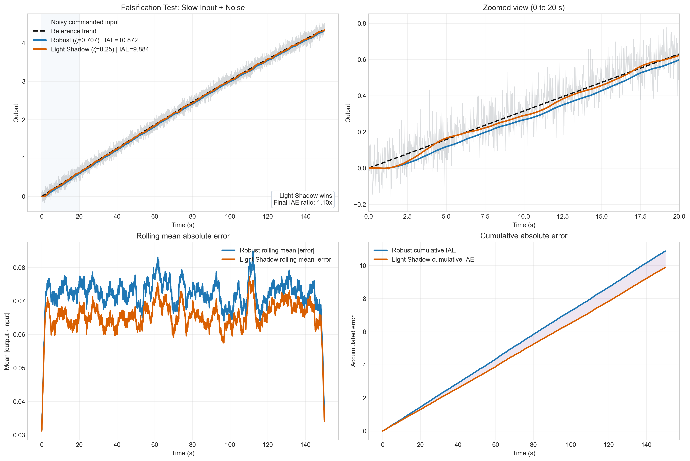
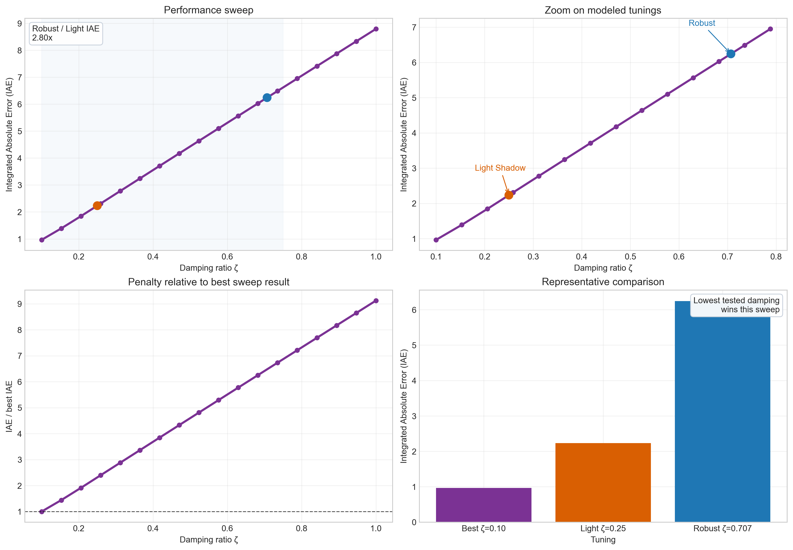

# The Pole's Shadow

Most introductions to control theory begin with a sensible question: **is the system stable?**

That question matters. A stable system settles. An unstable system can run away. But if we stop there, we miss something important. A system can be perfectly stable and still be disappointing. It can be too forgetful. It can settle so aggressively that it loses the ability to respond well to slow changes in the world around it.

This repository is built around that tension.

The project asks whether the location of a system's dominant poles tells us more than "safe" versus "unsafe." It asks whether pole location also tells us **how long the system stays alive enough to carry useful information forward in time**.

That is the idea behind the phrase **the pole's shadow**.

## The Project Idea

The short version is simple:

> A pole near the stability edge may give a system a longer useful memory window, while a pole pushed farther into the stable region may buy classical robustness at the cost of temporal sensitivity.

In the language of the project, distance from the imaginary axis may act like a kind of **cognitive budget**. A long shadow means the transient response lingers. A short shadow means the system forgets quickly.

That does not mean "less damping is always better." It means damping may trade one resource for another:

- faster settling,
- stronger classical stability margin,
- but shorter temporal integration capacity.

The concise thesis note for that claim lives in [docs/HYPOTHESIS.md](./docs/HYPOTHESIS.md).

## What This Repository Contains

This repository now has a small shared docs layer and a set of study capsules.

- [docs/HYPOTHESIS.md](./docs/HYPOTHESIS.md): the compact statement of the core claim and its falsifiable prediction.
- [docs/COGNITIVE-BUDGET.md](./docs/COGNITIVE-BUDGET.md): the working technical note where the "cognitive budget" framing starts becoming candidate diagnostics.
- [technical-note/technical_note.md](./technical-note/technical_note.md): the evolving technical note, written modestly as a proposal supported by the current study capsules.
- [technical-note/export/pole-shadow-technical-note.pdf](./technical-note/export/pole-shadow-technical-note.pdf): the latest exported PDF of the technical note.
- [studies/foundation-pole-shadow/README.md](./studies/foundation-pole-shadow/README.md): the long, student-friendly visual walkthrough of the original pole-shadow thesis.
- [studies/foundation-pole-shadow/runs/latest/plots/visual_proof_pole_shadow.pdf](./studies/foundation-pole-shadow/runs/latest/plots/visual_proof_pole_shadow.pdf): a one-file visual summary of the foundation study.
- [studies/foundation-pole-shadow/runs/latest/data/cognitive_budget_report.json](./studies/foundation-pole-shadow/runs/latest/data/cognitive_budget_report.json): the machine-readable baseline evidence bundle.
- [studies/settling-time-blind-spot/README.md](./studies/settling-time-blind-spot/README.md): the matched-settling hidden-cost study capsule.
- [studies/shadow-mass-saturation-threshold/README.md](./studies/shadow-mass-saturation-threshold/README.md): the shadow-mass sweet-spot concept capsule.
- [studies/feedback-measurement-noise-phase-transition/README.md](./studies/feedback-measurement-noise-phase-transition/README.md): the sensor-noise phase-transition study capsule.

If you want to reproduce the figures, the main scripts are:

- [`studies/foundation-pole-shadow/scripts/pole_shadow_plots.py`](./studies/foundation-pole-shadow/scripts/pole_shadow_plots.py): intuition plots, tradeoff plot, and the first slow-tracking comparison.
- [`studies/foundation-pole-shadow/scripts/falsify_pole_shadow_prediction.py`](./studies/foundation-pole-shadow/scripts/falsify_pole_shadow_prediction.py): falsification-style tests, damping sweep, and PDF summary.
- [`studies/foundation-pole-shadow/scripts/generate_cognitive_budget_data.py`](./studies/foundation-pole-shadow/scripts/generate_cognitive_budget_data.py): structured baseline evidence export for candidate diagnostics.
- [`studies/settling-time-blind-spot/scripts/latent_detector_study.py`](./studies/settling-time-blind-spot/scripts/latent_detector_study.py): the matched-settling latent-detector follow-up.
- [`studies/feedback-measurement-noise-phase-transition/scripts/feedback_measurement_noise_study.py`](./studies/feedback-measurement-noise-phase-transition/scripts/feedback_measurement_noise_study.py): the feedback sensor-noise phase-transition study.

What follows is a guided landing-page version of the story. It is shorter than the full walkthrough in [`studies/foundation-pole-shadow/README.md`](./studies/foundation-pole-shadow/README.md), but it keeps the core arc intact.

## The Story in Pictures

### 1. The First Intuition: Some Systems Forget Faster Than Others

Before talking about formulas, it helps to ask a physical question: after a system is disturbed, how long does the disturbance remain visible in its motion?

The blue system dies away quickly. The orange system keeps oscillating longer. Both may be stable, but they are not equally persistent. That is the first doorway into the project: pole location changes not only whether motion decays, but how long meaningful transient behavior remains available.

The figure is intentionally structured to teach the eye what matters. The full response gives context, the zoom makes the separation readable, the log-scale amplitude view exposes the different decay rates, and the cumulative panel turns "lingering dynamics" into something you can compare directly.

### 2. The Tradeoff: Robustness Can Spend Memory

Once that intuition is in place, the next question is whether it reflects a genuine design tradeoff.

This figure makes the project's central tension explicit. As the stability margin grows, the effective time horizon and memory proxy shrink. In plain language: the more aggressively we push the system away from the stability edge, the less long-term temporal budget it appears to keep.

That is the heart of the hypothesis. Classical design goals such as fast settling and conservative damping are valuable, but they may also make the system temporally myopic.

### 3. The First Prediction: Slow Signals Should Favor a Longer Shadow

If the idea is more than a metaphor, it should produce a concrete prediction: on slowly drifting inputs, a more lightly damped system should sometimes outperform a more heavily damped one.

This figure compares a classically robust tuning with a lighter-damped "long shadow" tuning on a slow ramp plus a low-frequency sine. The top panels show the overall tracking behavior and the early-time separation. The bottom panels reveal the real difference: one system accumulates substantially more tracking error over time.

That cumulative error view matters because near-overlapping response curves can be visually misleading. Two systems can look similar in the large and still differ meaningfully in the total amount of error they generate.

### 4. Supporting Tests: The Claim Should Survive More Than One Example

One plot is never enough. A useful idea should still say something coherent when the input changes shape.

#### Pure Slow Ramp

The simplest slow signal already reveals the pattern: the more heavily damped system lags more, and that lag accumulates into larger error.

#### Ramp Plus Low-Frequency Sine

This is a more realistic slow signal. The same basic story survives: the lighter-damped system remains closer to the target, and the cumulative error panel makes the difference easy to see.

#### Ultra-Slow Sine

This test isolates slow variation without a ramp. The result again points in the same direction, suggesting the effect is not tied to one special input shape.

#### Slow Input with Noise

This is the most cautious of the supporting plots. The lighter-damped system still wins on the chosen metric, but the advantage is smaller. That nuance matters. The project looks strongest on slow, clean tracking tasks, and more modest once noise becomes prominent.

### 5. The Broad Summary: What Happens Across Many Damping Ratios?

The final summary plot steps back from one pair of tunings and asks what happens across a sweep.

For the specific model and signal used here, performance worsens as damping ratio increases. The lighter-damped choice outperforms the more classically robust one, and the sweep makes that penalty visible from several angles rather than just one.

This does not establish a universal law. It does show that, within this family of examples, the pole-shadow hypothesis leaves a measurable footprint.

## What the Results Suggest

Taken together, these plots support a simple but powerful reframing:

**Pole location may regulate not only stability, but also the duration over which a system can integrate information through time.**

That makes the distance from the stability edge interesting in a new way. It is not just a margin. It may also be a budget. A system with a longer shadow has more time to respond to gradual structure in the input. A system with a shorter shadow may be safer in the classical sense while also being less sensitive to slow unfolding change.

For students, this is a useful conceptual upgrade. Control design is not only about preventing instability. It is also about deciding what kind of time-behavior you want the system to have.

## What This Does Not Yet Prove

The repository is making a serious claim, so it is worth being explicit about its limits.

These plots do **not** prove that lighter damping is always better. They do **not** settle questions involving:

- model uncertainty,
- actuator limits,
- nonlinear effects,
- safety-critical robustness requirements,
- full feedback architecture and measurement noise behavior.

What they do show is narrower and still valuable: in these linear examples, with these slow-signal tasks, the usual instinct to damp more aggressively can carry a hidden performance cost.

That is enough to justify the hypothesis as a real design question rather than a poetic slogan.

## Where to Go Next

If you want the project in three different levels of depth:

- Read [docs/HYPOTHESIS.md](./docs/HYPOTHESIS.md) for the concise claim.
- Read [docs/COGNITIVE-BUDGET.md](./docs/COGNITIVE-BUDGET.md) for the first technical formalization pass.
- Read [studies/foundation-pole-shadow/README.md](./studies/foundation-pole-shadow/README.md) for the full student-oriented visual story.
- Open [studies/foundation-pole-shadow/runs/latest/plots/visual_proof_pole_shadow.pdf](./studies/foundation-pole-shadow/runs/latest/plots/visual_proof_pole_shadow.pdf) for a compact summary artifact.
- Explore the newer study capsules in [studies/settling-time-blind-spot/README.md](./studies/settling-time-blind-spot/README.md), [studies/shadow-mass-saturation-threshold/README.md](./studies/shadow-mass-saturation-threshold/README.md), and [studies/feedback-measurement-noise-phase-transition/README.md](./studies/feedback-measurement-noise-phase-transition/README.md).

If you want to explore the evidence directly, start with:

- [`studies/foundation-pole-shadow/scripts/pole_shadow_plots.py`](./studies/foundation-pole-shadow/scripts/pole_shadow_plots.py)
- [`studies/foundation-pole-shadow/scripts/falsify_pole_shadow_prediction.py`](./studies/foundation-pole-shadow/scripts/falsify_pole_shadow_prediction.py)

The deepest question in the repository is also the simplest one:

**How long should a system remember?**
