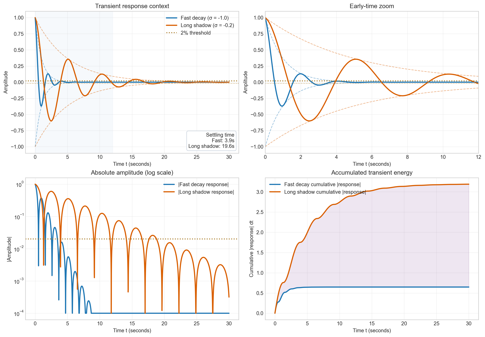
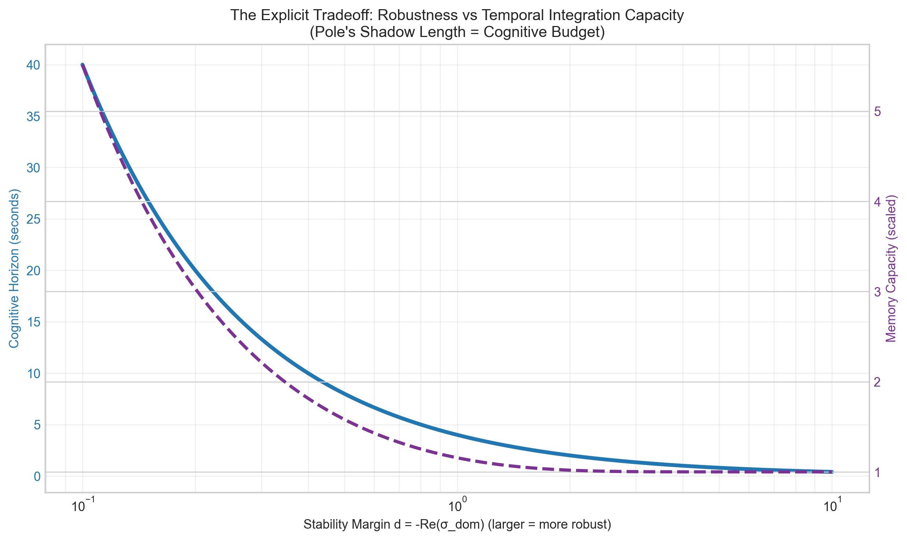
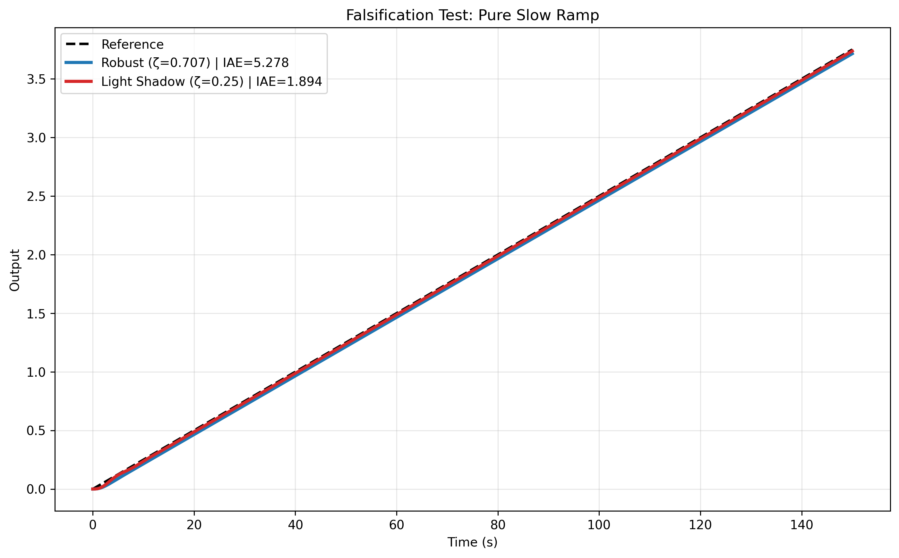
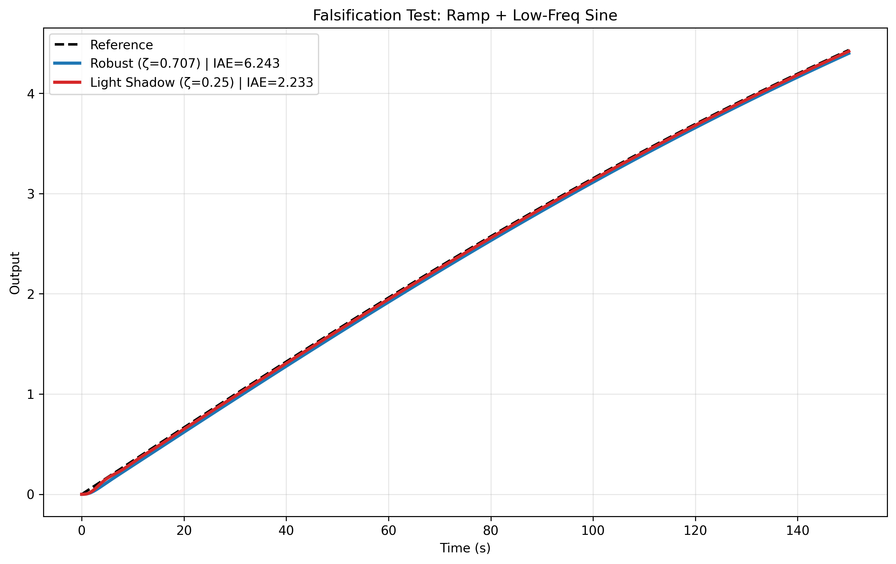
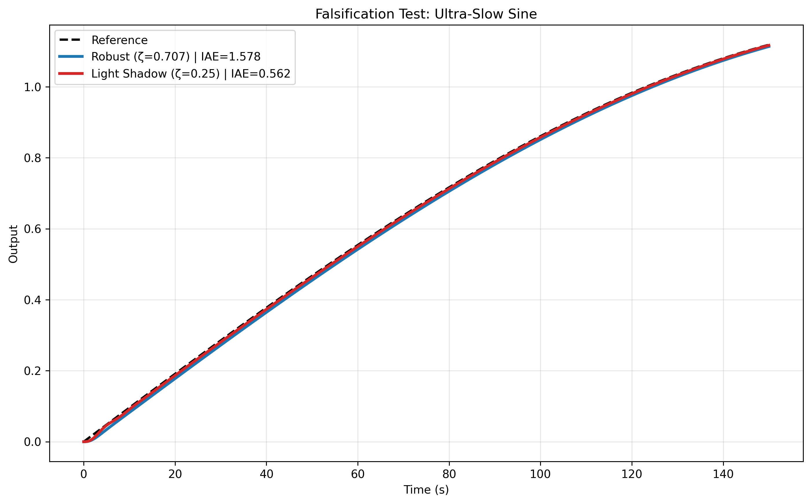
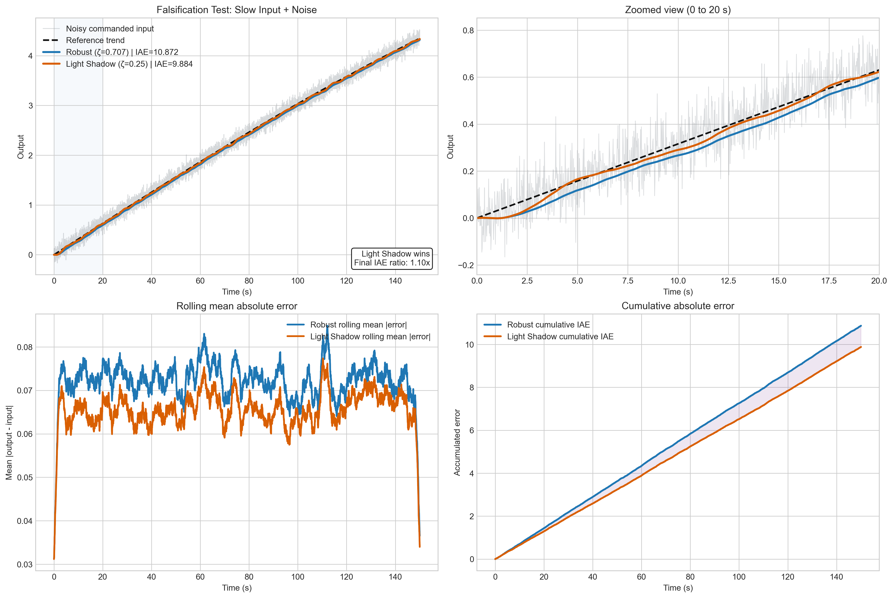
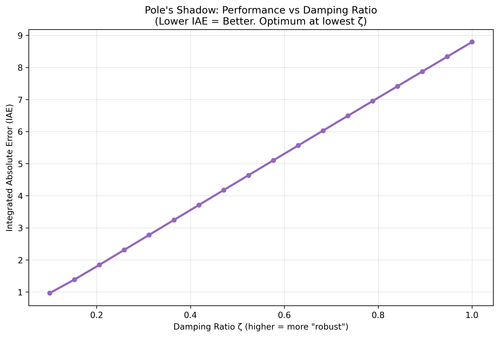

# Reading the Pole's Shadow

Imagine a car suspension after you hit a bump. Imagine a thermostat trying to keep a room comfortable on a day when the weather changes slowly. Imagine the human body adjusting heart rate, temperature, and blood chemistry over time. These are all examples of **dynamic systems**. Something changes, the system reacts, and the reaction unfolds across time.

That last phrase matters: **across time**.

When students first meet control theory, the first big question is often, "Is the system stable?" That is a good question, because unstable systems can be dangerous or useless. But it is not the only question. A system can be stable and still be disappointing. It can be stable and still react too slowly, forget too quickly, or fail to follow gradual changes in the world around it.

This project begins with a simple but provocative idea:

> A pole is not only a marker of stability. Its distance from the stability edge also tells us how long the system keeps useful transient behavior alive.

The project README says this more boldly: the distance from the imaginary axis may act like a **cognitive budget** for a linear system. A pole close to the imaginary axis gives the system a long "shadow," meaning its internal state hangs around longer. A pole farther left in the complex plane gives faster decay and stronger classical robustness, but it may also shorten the amount of time the system can integrate information.

For a brand-new student, that can sound abstract, so this README tells the story visually.

We will move in a simple order:

1. First, we will build intuition for what a "pole's shadow" looks like.
2. Then we will show the tradeoff the hypothesis predicts.
3. Then we will test whether that tradeoff actually matters when tracking slow inputs.
4. Finally, we will challenge the idea with several falsification-style plots.

The goal is not to pretend the subject is easy. The goal is to make the road into it visible.

## 1. What Is a Pole, in Plain Language?

In a linear dynamic system, poles are mathematical objects that tell us how the system's natural motions behave over time. If that sounds intimidating, here is the simple picture:

- A pole tells us whether a motion dies away, grows, or keeps oscillating.
- A pole farther into the left half-plane usually means faster decay.
- A pole closer to the imaginary axis usually means slower decay.

So when engineers say a system is "more stable" or has "more damping," they often mean the system's natural response fades away faster.

That sounds good, and often it is. But there is a tradeoff hiding inside that sentence. If the response fades away very quickly, then the system also stops carrying information from the recent past very quickly.

That hidden tradeoff is the heart of this project.

## 2. The First Picture: A Shadow That Dies Fast, and a Shadow That Lingers

The first figure is the easiest way into the whole idea.

The blue curve is a system with a dominant pole farther from the stability edge. Its oscillation dies out quickly. The orange curve is a system whose dominant pole is closer to the imaginary axis. Its motion hangs around much longer.

This is where the phrase **pole's shadow** comes from. If you disturb a system and then watch what remains, the leftover motion is its shadow. A short shadow means the system forgets quickly. A long shadow means the system keeps some memory of the disturbance for longer.

The four panels help you read the figure from different angles:

- The top-left panel shows the full transient response, so you can see the overall shape.
- The top-right panel zooms in on the early part, where the two systems begin to separate.
- The bottom-left panel uses a log scale for amplitude, which makes the difference in decay rates easier to see.
- The bottom-right panel accumulates the total amount of transient motion over time. This is a visual way of saying, "How much lingering dynamics did the system keep?"

For a beginner, here is the punchline: the orange system is not "better" in every possible sense. It is simply **alive longer**. The project hypothesis says that this longer-lived transient can be useful when the world changes slowly.

## 3. The Core Hypothesis of the Project

Now that we have an intuition, we can state the hypothesis more carefully.

The project README argues that the distance from the imaginary axis is not just a stability label. It may behave like a **time-budget denominator**. If you want the full original framing, you can read the main project README here: [../README.md](../README.md). In other words:

- poles closer to the imaginary axis give longer persistence,
- longer persistence gives a longer window for temporal integration,
- longer temporal integration may help with slowly changing inputs,
- pushing poles deeper left improves classical settling and robustness, but may also create temporal myopia.

That is a strong claim. It says that the usual engineering instinct, "make it settle faster," might quietly hurt performance on tasks where the system needs to follow slow drifts, low-frequency signals, or gradual disturbances.

That is not a rejection of standard control theory. It is a reframing. Stability still matters. Margin still matters. Damping still matters. The claim is that another resource matters too: **how long the system carries meaningful state forward in time**.

## 4. Turning Intuition into a Tradeoff

If the hypothesis is real, then there should be a visible tradeoff between classical robustness and temporal integration.

This figure makes the tradeoff explicit.

The top-left panel shows a "cognitive horizon" that shrinks as the stability margin grows. The top-right panel shows a memory-capacity proxy that also drops as the pole moves deeper into the stable region. The bottom-left panel normalizes the curves so you can compare their shape directly. The bottom-right panel groups a few representative regimes, near the stability edge, mid margin, and deeply stable, to show how much temporal budget is being lost.

For a new student, here is the key idea:

If you tune a system to erase its past very quickly, then you are also tuning it to remember less.

That does not mean high damping is wrong. It means every tuning choice spends one resource to buy another. You can buy fast settling, but you may spend long-term responsiveness. You can buy conservative stability margin, but you may spend temporal sensitivity.

At this point, the project has moved from a metaphor to a testable prediction:

> A lightly damped system should track slow changes better than a more heavily damped one, even if the heavily damped one looks more classically robust.

## 5. A First Prediction: Tracking a Slowly Drifting Input

Now we ask the simplest practical question: if the world changes slowly, which tuning follows it better?

This figure compares two systems:

- **Robust**: damping ratio `zeta = 0.707`
- **Light Shadow**: damping ratio `zeta = 0.25`

The input is a slow ramp plus a low-frequency sine wave. That is a simple way to represent something that drifts gradually but is not perfectly straight.

The top-left panel gives the full tracking context. The top-right panel zooms in on the first part of the motion, where the separation is easier to see. The bottom-left panel shows signed tracking error, which tells you whether the output falls behind or gets ahead. The bottom-right panel accumulates absolute error over time.

Why is the cumulative plot so useful? Because two curves can look almost identical by eye and still have meaningfully different performance. If one curve is consistently just a little farther from the target, that small difference keeps adding up. The cumulative error plot turns that hidden gap into something visible.

Here, the orange "Light Shadow" system stays closer overall. That is exactly the kind of result the hypothesis predicted.

## 6. If the Hypothesis Is Serious, It Should Survive Simple Tests

At this point, a careful student should become suspicious in a healthy way. One example is not enough. A theory should face multiple tests, especially tests that could have gone the other way.

So the project includes a set of falsification-style plots. These do not prove the hypothesis in some final sense, but they do ask whether the claim survives several related scenarios.

Before looking at them, one measurement appears repeatedly: **IAE**, or **Integrated Absolute Error**.

This is beginner-friendly if you read it literally:

- take the tracking error,
- make it positive so you count all misses,
- add it up across time.

Lower IAE means the output spent less total time away from the desired signal.

## 7. Test One: A Pure Slow Ramp

The first falsification test uses the simplest slow signal possible: a ramp.

This is a clean place to start because there is very little visual clutter. The two systems both look respectable on the full response plot, but the zoomed panel and the cumulative error panel reveal the real difference. The more heavily damped system lags farther behind, and that lag accumulates into much larger IAE.

This is important educationally. Students often trust the full response panel too much. If two curves nearly overlap, it is tempting to conclude they are basically the same. But engineering performance lives in the details. The lower panels teach the eye what to pay attention to.

## 8. Test Two: A Ramp Plus a Low-Frequency Sine

Next we make the input more realistic by combining slow drift with slow oscillation.

This is where the narrative of the project becomes clearer. The orange curve, the system with the longer pole shadow, remains closer to the reference. The error panel shows that both systems fall behind, but the robust system falls behind more. The cumulative error panel makes the outcome almost impossible to miss.

This plot matters because real environments are rarely perfect ramps. They drift, sway, and wander. A good theory should still tell a useful story when the input has more structure.

## 9. Test Three: An Ultra-Slow Sine

Now the input is a pure, very low-frequency oscillation.

This test isolates the idea of slow variation itself. There is no overall ramp upward. There is just a very gradual back-and-forth signal. Once again, the lightly damped system performs better on the chosen metric.

Why does this matter? Because it shows that the project is not only about ramps. The same pattern appears when the world changes slowly but cyclically.

This strengthens the central intuition: a longer-lived transient can help when the signal you care about also unfolds on a long timescale.

## 10. Test Four: What Happens When Noise Appears?

The next question is natural: what if the world is messy?

This plot adds noise to the commanded input. The gray trace shows the noisy signal, while the dashed black line shows the smoother underlying trend. The two system outputs are still readable because the plot separates the tasks of seeing context, seeing the early-time zoom, seeing rolling average error, and seeing cumulative error.

The result is more nuanced here. The lightly damped system still wins on the script's metric, but the gap is much smaller than in the cleaner tests. That is exactly the kind of thing a student should notice. Good scientific storytelling does not erase nuance. It highlights it.

This figure says:

- the main claim still survives this particular noisy test,
- but the advantage is weaker,
- so the hypothesis looks more convincing in slow, clean tracking tasks than in noisy ones.

That is a healthier conclusion than simply saying "orange wins again."

## 11. Sweeping Across Many Damping Ratios

The final figure zooms out. Instead of comparing just two tunings, it asks what happens as damping ratio changes across a whole range.

This is the broadest summary plot in the set.

The top-left panel shows the full sweep. The top-right panel zooms in on the tunings most relevant to the comparison in this project. The bottom-left panel expresses performance as a penalty relative to the best case in the sweep. The bottom-right panel compares three representative choices directly: the best tested damping ratio, the light-shadow choice, and the more classically robust choice.

For the specific model and test signal used here, the message is simple:

- lower tested damping gives lower IAE,
- the light-shadow tuning outperforms the robust tuning,
- the robust tuning pays a clear tracking penalty.

This does not prove a universal law for all systems. It does show that, in this family of examples, the project hypothesis is not just a poetic metaphor. It has a measurable footprint.

## 12. What a New Student Should Take Away

If you are meeting this subject for the first time, here is the most useful summary:

**Control theory is not only about preventing disaster. It is also about choosing what kind of time-behavior you want.**

This project asks you to look at poles differently:

- not only as a stability certificate,
- not only as a settling-time lever,
- but also as a clue about how long a system can carry useful memory of recent inputs.

That is why the phrase **cognitive budget** appears in the project. It is a metaphor, but it is a productive one. A system with a long shadow has more time to integrate slow information. A system with a short shadow forgets quickly and may react with temporal myopia.

## 13. What These Plots Do, and What They Do Not Do

It is important to end honestly.

These plots support the project's narrative within a set of simple linear models and chosen input signals. They show that a lightly damped system can outperform a more heavily damped one on slow tracking tasks, and they show that the difference becomes easier to see when you inspect error and cumulative error directly.

But these plots do **not** settle every question. They do not, by themselves, account for every concern an engineer might have in real applications:

- model uncertainty,
- actuator saturation,
- unmodeled disturbances,
- safety margins,
- nonlinearity,
- sensor and feedback architecture.

So the right conclusion is not, "more damping is bad." The right conclusion is:

> Stability margin is not the whole story. Temporal integration has value too.

That is the doorway this project opens.

## 14. Where to Go Next

If this folder has done its job, you should now be able to read the main project claim with clearer eyes:

- poles tell us about stability,
- pole location also shapes memory and responsiveness,
- the distance from the stability edge may behave like a hidden resource budget,
- designing only for fast settling can sacrifice performance on slow tasks.

That is a sophisticated idea, but it begins with a very human question:

**How long should a system remember?**

If you want a one-file visual summary after reading this story, you can also open the PDF:

[Visual proof PDF](./visual_proof_pole_shadow.pdf)
