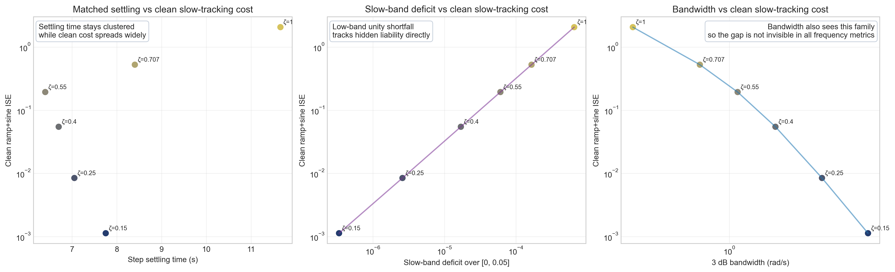
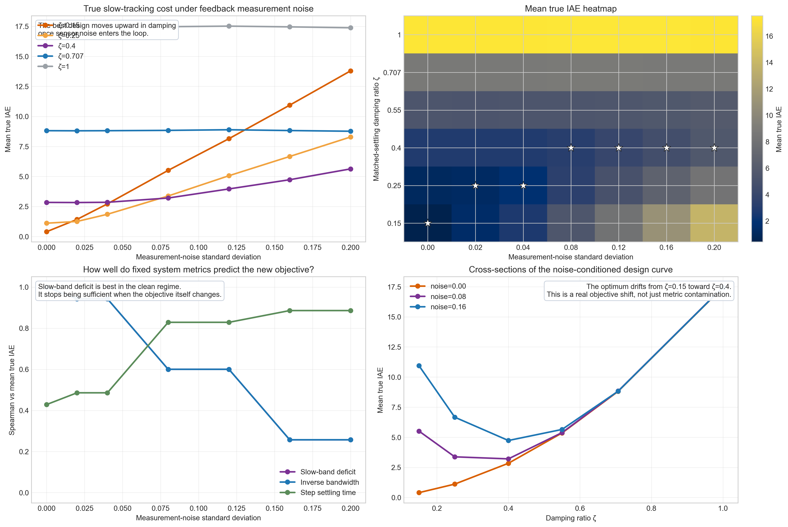
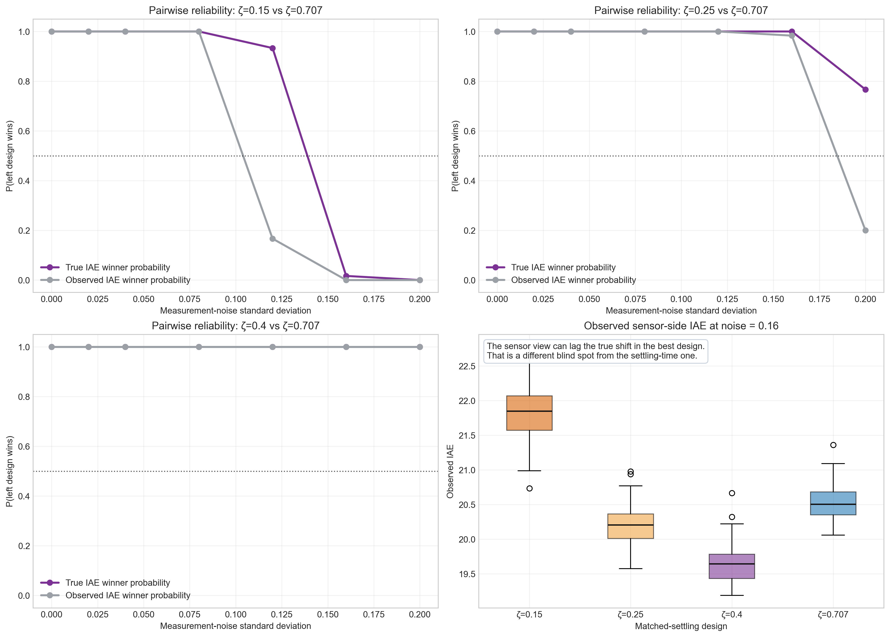
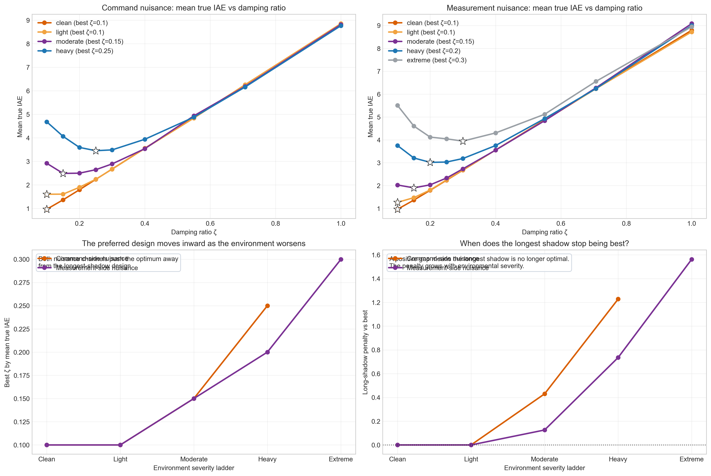
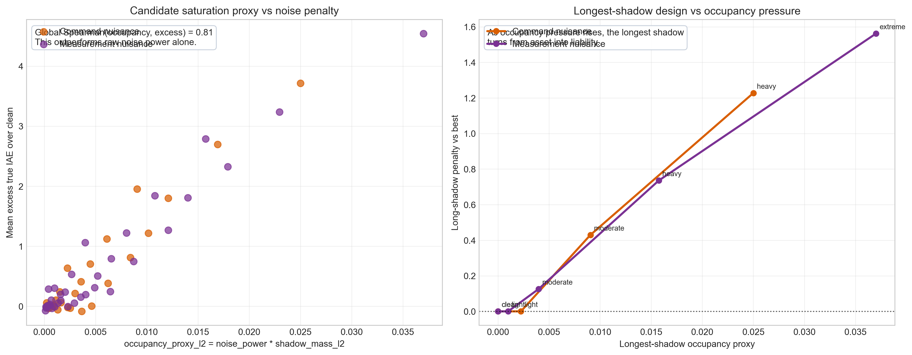

**Keywords:** slow tracking; feedback systems; settling time; damping ratio; low-frequency tracking; diagnostic framework; measurement noise; shadow mass

# Opening Statement

This note addresses a narrow but potentially useful control question: can slow-tracking performance require its own diagnostic layer beyond ordinary transient summaries?

The issue is not whether settling time, overshoot, bandwidth, and stability margins are useful. They are. The issue is whether those familiar quantities fully characterize how well a feedback system follows gradual change over time. The current studies in this repository suggest that they do not.

The note therefore proposes a modest framework rather than a finished doctrine. It does not claim a universal law, and it does not claim that classical control metrics should be replaced. It proposes that slow-tracking quality deserves a more explicit diagnostic vocabulary, especially in regimes where step-response summaries compress away a task-relevant temporal dimension.

# Core Proposal

The central proposal of this note is simple:

> slow-tracking performance in feedback systems is not fully characterized by standard settling-time style summaries, and can benefit from an additional diagnostic layer built around persistence, shadow mass, and low-band tracking deficit.

This proposal grows out of the broader pole-shadow hypothesis in the repository: the distance of dominant closed-loop poles from the stability edge may regulate not only whether motion decays, but how long the system remains dynamically "alive" enough to carry useful state forward in time.

At the current stage of the work, the framework has three candidate components:

1. `H_epsilon`, a shadow-horizon metric that asks how long a transient remains meaningfully visible.
2. `M`, a shadow-mass metric that asks how much lingering transient budget the system carries in total.
3. `D_Omega`, a slow-band deficit metric that asks how much low-frequency tracking shortfall remains in the closed loop.

The first two are intended as intrinsic or near-intrinsic descriptors of temporal persistence. The third is a task-facing descriptor. The current computational evidence is strongest for the third object.

# Why the Proposal Is Nontrivial

Claims about better low-frequency tracking are weak if they merely restate that bandwidth matters. The nontrivial part of the current work is narrower and more specific.

The studies suggest that two systems can look broadly similar under settling-time summaries and still differ substantially in slow-input tracking cost. That creates a blind spot:

> step-response equivalence is not the same thing as slow-tracking equivalence.

The framework proposed here is meant to name and measure that gap. In the current evidence, the strongest early success is not that a new metric dominates every familiar quantity. The stronger and more careful success is that ordinary settling-time summaries can miss a task-relevant distinction that low-band diagnostics recover more directly.

# Diagnostic Logic

The framework is currently organized around three diagnostic roles.

First, a persistence diagnostic should say how long a system stays meaningfully active after excitation. That is the role of the shadow horizon.

Second, a budget diagnostic should say how much lingering transient structure the system carries in total. That is the role of shadow mass.

Third, a task diagnostic should say how much low-frequency tracking capacity has been lost in the closed loop. That is the role of slow-band deficit.

The working expectation is that no single scalar will do every job well. The more realistic outcome is a compact diagnostic family with a division of labor:

- a persistence metric,
- a budget metric,
- and a task metric.

That division is a strength rather than a weakness. It lets the framework stay modest while still being useful.

The newer shadow-mass evidence also suggests a possible fourth object, or perhaps a bridge between the second and third roles: an environment-conditioned occupancy proxy. In the current study, the most useful candidate is `noise_power * shadow_mass_l2`, which treats shadow mass not only as a budget but as something the environment can load with nuisance energy.

# Foundation Evidence

The foundation study in this repository establishes the motivating pattern: in a controlled second-order family, a more lightly damped design can outperform a more heavily damped design on slowly varying tracking tasks.

That result does not yet define a new diagnostic. What it does is motivate the need for one. The key point is that a system can be perfectly stable, visually well behaved, and still accumulate substantially more slow-tracking error than a less heavily damped alternative.

{ width=92% }

This is the doorway into the rest of the note. If the effect were limited to vague visual impressions, there would be little to formalize. The point of the later studies is to show that the effect survives more careful comparison and begins to admit diagnostic structure.

# Study 1: The Settling-Time Blind Spot

The cleanest current evidence for a new diagnostic need comes from the matched-settling study. In that family, systems are arranged so that settling-time behavior is similar enough that ordinary transient summaries look far more informative than they really are.

The result is that settling time ranks clean slow-tracking cost poorly, while a low-band system-side metric ranks it perfectly in the tested family.

In the current run:

- step-settling-time rank fidelity to clean slow-tracking cost is `0.43`,
- slow-band-deficit rank fidelity is `1.0`,
- and bandwidth also orders the family perfectly in this specific matched-settling regime.

That last point matters. The present claim is not that slow-band deficit is the only useful frequency-domain quantity. The more careful claim is that **settling-time summaries alone leave out a task-relevant distinction**, and that low-band diagnostics recover it directly.

{ width=92% }

This is the strongest current evidence for the phrase "settling-time blind spot."

# Study 2: Measurement-Noise Phase Transition

The strongest study in the repository beyond the foundation work is the feedback measurement-noise follow-up. This study changes the problem in an important way by placing noise in the measurement channel inside a feedback interpretation of the closed-loop models.

Under clean conditions, the best damping ratio in the matched family is `zeta = 0.15`. As measurement noise increases, the best design moves first to `zeta = 0.25` and then to `zeta = 0.4`.

This means a clean-regime low-band diagnostic is not automatically a full noisy-regime design rule. Once measurement noise becomes strong enough to reshape the objective itself, the question is no longer only "which design preserves the most temporal competence?" It becomes "which design balances temporal competence against noise recycling most effectively in this environment?"

{ width=92% }

This phase-transition behavior strengthens the framework by making it more honest. It suggests that a slow-tracking diagnostic layer must eventually become environment-aware rather than remaining a purely clean-regime descriptor.

# Study 3: Observed Metrics Can Lag the Truth

The feedback measurement-noise study also exposes a second blind spot. Even after the true optimum begins to move, the observed sensor-side error metric can lag that shift or misreport it.

In the current run, for `zeta = 0.15` versus `zeta = 0.707` at measurement-noise level `0.12`, the lower-damping design still wins on true tracking cost with probability about `0.93`, but the observed metric reports it as the winner only about `0.17` of the time. At higher noise, the same kind of mismatch appears for `zeta = 0.25` versus `zeta = 0.707`.

{ width=92% }

This does not weaken the diagnostic framework. It sharpens it. A future slow-tracking framework will likely need to distinguish at least two things:

- latent clean-regime liability,
- and noise-conditioned operating truth.

# Study 4: Shadow-Mass Saturation and the Moving Sweet Spot

The newest study in the repository strengthens that second point by giving the environment-aware story a more concrete mechanism. Instead of asking only whether the best damping ratio moves, it asks whether there is a preferred shadow-mass budget for each operating regime.

The result is a moving sweet spot. In the current study, the clean optimum occurs at `zeta = 0.1` for both nuisance ladders. Under command-side nuisance, the preferred design then moves inward through `zeta = 0.15` and reaches `zeta = 0.25` in the heaviest tested regime. Under measurement-side nuisance, the preferred design moves through `zeta = 0.15` and `zeta = 0.2`, reaching `zeta = 0.3` in the most extreme tested regime.

That result matters because it replaces a vague warning about "too much memory" with a measurable design picture. The longest shadow is best in clean conditions, but not indefinitely. As nuisance grows, the best-performing design shifts toward a smaller but still nonzero shadow mass.

{ width=92% }

The study also introduces a candidate explanatory variable: `occupancy_proxy_l2 = noise_power * shadow_mass_l2`. In the current run, this proxy tracks excess slow-tracking penalty more clearly than noise power alone, with a global Spearman correlation of about `0.81` against the mean excess penalty and an even stronger value in the measurement-side nuisance ladder.

The point is not that this proxy is already a finished diagnostic. The point is that shadow mass now has a stronger role than a metaphor. It can be treated as a budget that the environment partially fills, and the quality of a design depends on whether that budget is matched to the nuisance conditions it will face.

{ width=92% }

This study changes the framework in an important way. Shadow mass is no longer only a candidate intrinsic descriptor of persistence. It is also a candidate ingredient in an environment-aware design diagnostic.

# What the Current Evidence Supports

At the current stage of the project, the following claims appear supportable.

1. Standard settling-time summaries do not fully characterize slow-tracking performance.
2. In controlled second-order families, low-band system-side diagnostics can reveal clean slow-tracking liability more directly than settling-time summaries.
3. The true best damping ratio for slow tracking can shift when measurement noise enters the feedback path strongly enough.
4. The preferred shadow-mass budget can move inward as command-side or measurement-side nuisance grows.
5. Any eventual diagnostic framework for slow tracking will likely need both a clean-regime competence measure and an environment-aware noise sensitivity measure.

These are meaningful claims, but they are still narrower than a finished theory.

# Limits and Scope

This note is based on controlled computational studies rather than hardware experiments. The systems studied so far are low-order and intentionally structured so that the main effects are legible. That makes the current evidence useful for formulation, but it also limits how broadly the results should be generalized.

The note does not yet establish:

- a universally best scalar diagnostic,
- a complete mathematical reduction of the "cognitive budget" idea,
- superiority over all bandwidth-based summaries across broader plant families,
- or a final design rule for noisy real-world systems.

The current status is best described as a working framework supported by controlled examples.

# Practical Interpretation

The practical lesson of the note is not that engineers should ignore settling time. The practical lesson is that settling time should not be used by itself as a proxy for slow-tracking quality.

If the environment contains meaningful low-frequency structure, then the designer may need a second question alongside the usual transient questions:

> how much slow-tracking competence does this design preserve, and how does that competence change once noise enters the loop?

The newer shadow-mass result sharpens that practical question one step further:

> how much temporal budget does this environment actually permit before extra persistence turns into stored nuisance energy?

That is the design space this framework is trying to make visible.

# Next Revision Targets

This note is meant to evolve. The strongest next steps are:

1. extend the shadow-mass study beyond the current second-order family and test whether occupancy-style proxies generalize,
2. prove monotonicity or separation results for one or more candidate diagnostics,
3. test broader plant and controller families,
4. sharpen the distinction between clean-regime liability detection and noisy-regime optimum prediction,
5. compare the framework more systematically against bandwidth-based summaries.

# Conclusion

This technical note proposes a modest diagnostic framework for slow-tracking performance in feedback systems. The framework is motivated by the observation that ordinary settling-time summaries can compress away a task-relevant temporal dimension. The current evidence suggests that low-band diagnostics can reveal clean-regime slow-tracking liability more clearly, that feedback measurement noise can shift the true best damping ratio in ways that ordinary observed metrics may not show immediately, and that the preferred shadow-mass budget itself can move inward as nuisance grows.

That is enough to justify continued development. It is not yet enough to declare a finished theory. The value of the framework at this stage is that it turns an intuition into a structured, revisable technical program.

# Artifact References

- [Repository landing page](../README.md)
- [Hypothesis note](../docs/HYPOTHESIS.md)
- [Cognitive-budget note](../docs/COGNITIVE-BUDGET.md)
- [Foundation study capsule](../studies/foundation-pole-shadow/README.md)
- [Settling-time blind-spot study capsule](../studies/settling-time-blind-spot/README.md)
- [Shadow-mass saturation study capsule](../studies/shadow-mass-saturation-threshold/README.md)
- [Feedback measurement-noise study capsule](../studies/feedback-measurement-noise-phase-transition/README.md)
